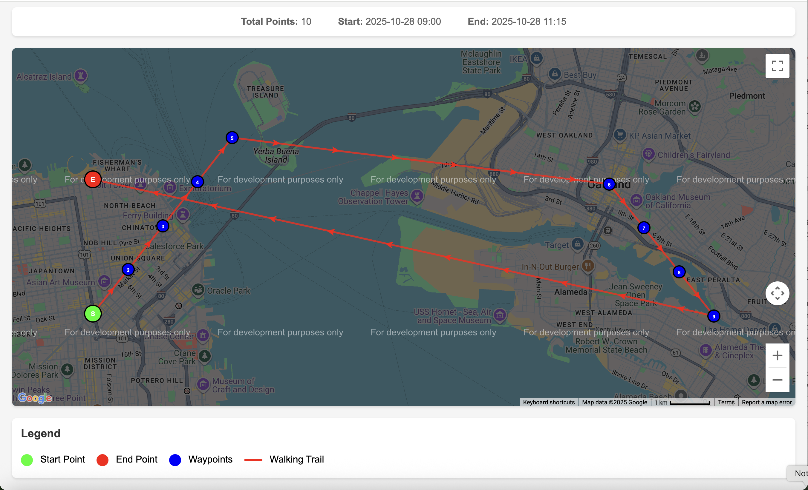

# 🛰️ GeoChrono

GeoChrono is a lightweight Golang application that visualizes GPS coordinate data over time. It parses latitude, longitude, and timestamp records from CSV files, then generates an interactive Google Map showing pins connected chronologically — effectively mapping your journey through time and space.

## 🚀 Features

- 🗺️ **Automatic map generation** — creates a Google Map with pins for each coordinate
- ⏱️ **Chronological connections** — draws lines between pins based on timestamps
- 📄 **CSV data ingestion** — supports flexible CSV input with customizable column mapping
- 🧭 **Interactive visualization** — zoom, pan, and inspect points directly in the browser
- ⚙️ **Powered by Go** — fast, cross-platform, and dependency-light
- 🌐 **Google Maps integration** — customizable styling and markers
- 🔧 **Configurable** — extensive customization options via YAML config
## 🧩 Input Format

Your CSV file should have the following structure:

```csv
timestamp,latitude,longitude,title,description
2025-10-28T09:00:00Z,37.7749,-122.4194,Golden Gate Park,Starting point of our walking tour
2025-10-28T09:15:00Z,37.7849,-122.4094,Haight-Ashbury,Historic neighborhood visit
2025-10-28T09:30:00Z,37.7949,-122.3994,Castro District,Exploring the vibrant Castro area
```

> ⚠️ **Note:**
> - Timestamps should be in ISO 8601 or Unix format
> - Latitude and longitude should be decimal degrees (e.g., 37.7749,-122.4194)
> - Title and description columns are optional but enhance the map experience
> - The project includes sample data in `data/coordinates.csv` for testing

### Sample Data Included

The project comes with sample GPS data (`data/coordinates.csv`) showing a walking tour of San Francisco, including stops at:
- Golden Gate Park
- Haight-Ashbury
- Castro District  
- Mission District
- SOMA
- Embarcadero
- Ferry Building
- Pier 39
- Fisherman's Wharf
## � Data Sources

GeoChrono can work with GPS data from various sources:

### Common Use Cases

- **GPS tracking devices** — Import data from hiking GPS units, fitness trackers, or mobile apps
- **Vehicle tracking** — Visualize fleet movements or personal travel routes  
- **Mobile app exports** — Process location data from smartphone apps
- **IoT device logs** — Track asset movement over time
- **Security systems** — Visualize patrol routes or access point usage
- **Research data** — Map animal tracking, environmental monitoring, or field surveys

### Data Preparation

Ensure your CSV data includes:
- **Timestamp** — When the location was recorded
- **Latitude** — Geographic latitude in decimal degrees
- **Longitude** — Geographic longitude in decimal degrees
- **Title** (optional) — Name or label for the location
- **Description** (optional) — Additional details about the point

Example data sources that can be converted to this format:
- Google Location History exports
- Strava activity exports
- GPS logger device outputs
- Mobile app location data
- Fleet management system exports
## 🧠 How It Works

1. **Parse CSV**: GeoChrono reads timestamp and coordinate data
2. **Sort by time**: Ensures chronological order
3. **Generate Map**: A Google Maps HTML file is generated with all points plotted
4. **Connect Points**: Polyline connections drawn between consecutive timestamps
5. **Output File**: Open `map.html` to visualize your path

## 📸 Screenshot

Here's what the generated interactive map looks like:



**What you'll see:**
- 🟢 **Start marker** (green) - Beginning of your journey
- 🔴 **End marker** (red) - Final destination  
- 🔵 **Waypoint markers** (blue) - Numbered sequence points
- 🔗 **Connected path** (red line) - Chronological route between points
- ℹ️ **Interactive info windows** - Click any marker for details (timestamp, coordinates, description)
- 🎛️ **Map controls** - Zoom, street view, fullscreen, map type switching
- 📊 **Statistics bar** - Total points, start/end times displayed at the top

The map is fully interactive - you can zoom, pan, switch between map/satellite view, and click on any marker to see detailed information about that GPS point.

## ⚙️ Installation & Usage

### Prerequisites
- Go 1.21 or later installed on your system
- A valid Google Maps API key (required for map display)

### 1. Clone and Setup

```bash
git clone https://github.com/saratily/geo-chrono.git
cd geo-chrono
```

### 2. Quick Test Run

First, test the application with the included sample data:

```bash
# Navigate to the project directory
cd geo-chrono

# Set your Google Maps API key (replace with your actual key)
export GOOGLE_MAPS_API_KEY="your_google_maps_api_key_here"

# Run the application
go run cmd/geo-chrono/main.go

# Alternative: Build and run
go build -o geo-chrono cmd/geo-chrono/main.go
./geo-chrono
```

**Expected Output:**
```
Map generated successfully: map.html
Open the file in your browser to view the interactive map
```

### 3. View the Generated Map

```bash
# Open the generated map in your default browser
open map.html        # macOS
xdg-open map.html    # Linux
start map.html       # Windows
```

### 4. Production Usage Examples

#### Basic Usage (using default config.yaml):
```bash
export GOOGLE_MAPS_API_KEY="your_api_key"
go run cmd/geo-chrono/main.go
```

#### Custom CSV file:
```bash
go run cmd/geo-chrono/main.go -csv /path/to/your/gps_data.csv -out custom_map.html
```

#### Override configuration:
```bash
go run cmd/geo-chrono/main.go \
  -csv ./my_data.csv \
  -out ./output/my_route.html \
  -title "My Adventure Route" \
  -apikey "your_api_key"
```

#### Using a custom config file:
```bash
go run cmd/geo-chrono/main.go -config /path/to/custom_config.yaml
```
## 🧭 Command-Line Options

| Flag | Description | Example |
|------|-------------|---------|
| `-config` | Path to configuration file | `-config ./config.yaml` |
| `-csv` | Path to input CSV file (overrides config) | `-csv my_gps_data.csv` |
| `-apikey` | Google Maps API key | `-apikey YOUR_API_KEY` |
| `-out` | Output HTML filename (overrides config) | `-out my_route_map.html` |
| `-title` | Map title (overrides config) | `-title "My GPS Journey"` |

### Testing

The project includes sample GPS data in `data/coordinates.csv` for testing. Make sure you have a valid Google Maps API key before running.

## 🔧 Troubleshooting

### Common Issues and Solutions

#### 🚨 Issue: Map is completely blank/white

**Symptoms:** The HTML page loads but shows only a white/gray area where the map should be.

**Causes & Solutions:**

1. **Invalid or Missing API Key**
   ```bash
   # Check if your API key is set
   echo $GOOGLE_MAPS_API_KEY
   
   # Test with a valid API key
   export GOOGLE_MAPS_API_KEY="your_valid_api_key"
   go run cmd/geo-chrono/main.go
   ```

2. **API Key Not Enabled for Maps JavaScript API**
   - Go to [Google Cloud Console](https://console.cloud.google.com/)
   - Navigate to "APIs & Services" > "Library"
   - Search for "Maps JavaScript API" and ensure it's **enabled**

3. **Billing Not Enabled**
   - Google Maps API requires a billing account to be linked
   - Go to Google Cloud Console > "Billing" and enable billing for your project

#### 🗺️ Issue: Pins show but no map background

**Symptoms:** You can see the GPS pins/markers but the actual map tiles (streets, terrain) don't load.

**Common Causes & Solutions:**

1. **API Key Domain Restrictions**
   ```bash
   # Try without domain restrictions first
   # In Google Cloud Console > APIs & Services > Credentials
   # Edit your API key > Application restrictions > Select "None"
   ```

2. **Browser Console Errors**
   - Open browser Developer Tools (F12)
   - Check the Console tab for errors:
     - `RefererNotAllowedMapError`: API key domain restriction issue
     - `InvalidKeyMapError`: Invalid API key
     - `RequestDeniedMapError`: API not enabled or billing not set up

3. **Network/Firewall Issues**
   - Ensure your network allows connections to `maps.googleapis.com`
   - Try disabling VPN or proxy temporarily

4. **JavaScript Errors**
   - Check browser console for any JavaScript errors
   - Ensure your browser supports modern JavaScript

#### 📍 Issue: No pins/markers visible

**Symptoms:** Map loads but no GPS points are displayed.

**Solutions:**

1. **Check CSV Data Format**
   ```bash
   # Verify your CSV has the correct structure
   head -5 data/coordinates.csv
   
   # Should show headers like: timestamp,latitude,longitude,title,description
   ```

2. **Validate GPS Coordinates**
   - Ensure latitude is between -90 and 90
   - Ensure longitude is between -180 and 180
   - Check for missing or null values

3. **Check Configuration**
   ```bash
   # Verify config.yaml has correct column names
   cat config.yaml | grep -A 10 "csv_format:"
   ```

#### 💻 Issue: Application fails to start

**Common Error Messages and Solutions:**

1. **"Error loading configuration"**
   ```bash
   # Check if config.yaml exists and is valid
   ls -la config.yaml
   
   # Validate YAML syntax
   go run cmd/geo-chrono/main.go -config config.yaml
   ```

2. **"Error reading CSV file"**
   ```bash
   # Check if CSV file exists and is readable
   ls -la data/coordinates.csv
   
   # Check CSV format
   head -3 data/coordinates.csv
   ```

3. **"Configuration validation failed"**
   ```bash
   # Ensure API key is properly set
   export GOOGLE_MAPS_API_KEY="your_key_here"
   
   # Or provide via command line
   go run cmd/geo-chrono/main.go -apikey "your_key_here"
   ```

#### 🔍 Debugging Steps

1. **Enable Verbose Logging**
   ```bash
   # Run with verbose output to see detailed processing info
   go run cmd/geo-chrono/main.go -config config.yaml
   # Check config.yaml and set logging.verbose: true
   ```

2. **Test with Sample Data**
   ```bash
   # Always test with the included sample data first
   export GOOGLE_MAPS_API_KEY="your_key"
   go run cmd/geo-chrono/main.go
   # This should work if everything is configured correctly
   ```

3. **Browser Developer Tools**
   ```bash
   # After opening map.html, press F12 and check:
   # - Console tab for JavaScript errors
   # - Network tab for failed requests
   # - Elements tab to verify HTML structure
   ```

4. **Validate Generated HTML**
   ```bash
   # Check if HTML file was created and has content
   ls -la map.html
   
   # Verify it contains your API key
   grep -i "googleapis" map.html
   ```

#### 📞 Still Having Issues?

If you're still experiencing problems:

1. **Check the Console Output** - Look for error messages when running the application
2. **Verify Sample Data Works** - Test with the included `data/coordinates.csv` first  
3. **Browser Console** - Open F12 Developer Tools and check for JavaScript errors
4. **API Key Quotas** - Check your Google Cloud Console for API usage limits
5. **File Permissions** - Ensure the application can write to the output directory

**Quick Health Check Command:**
```bash
# Test everything is working with sample data
export GOOGLE_MAPS_API_KEY="your_key_here"
go run cmd/geo-chrono/main.go && echo "Success! Opening map..." && open map.html
```
## 🧮 Example Output

After running, you'll find: `map.html`

Open it in your browser to see:
- 📍 Pins for each timestamped coordinate
- 🔗 Connected lines showing travel path
- ℹ️ Info windows showing timestamps and coordinates
## 🗝️ Google Maps API Key Setup

> **⚠️ Important:** A valid Google Maps API key is required for the map to display properly. Without it, you'll see pins but no map background.

### API Key Requirement
A valid Google Maps API key is **required** for the application to work properly. Without it, the map will not display correctly.

### For Production Use - Complete Setup Guide

#### Step 1: Access Google Cloud Console
1. Go to [Google Cloud Console](https://console.cloud.google.com/)
2. Sign in with your Google account
3. If you don't have a Google account, create one first

#### Step 2: Create or Select a Project
1. Click on the project dropdown at the top of the page
2. Either:
   - **Create New Project**: Click "New Project", enter a name (e.g., "geochrono-maps"), then click "Create"
   - **Select Existing**: Choose an existing project from the list

#### Step 3: Enable the Maps JavaScript API
1. In the left sidebar, navigate to **"APIs & Services"** > **"Library"**
2. Search for **"Maps JavaScript API"**
3. Click on the **"Maps JavaScript API"** result
4. Click the **"Enable"** button
5. Wait for the API to be enabled (this may take a few moments)

#### Step 4: Create API Credentials
1. Go to **"APIs & Services"** > **"Credentials"**
2. Click **"+ CREATE CREDENTIALS"** at the top
3. Select **"API key"** from the dropdown
4. Your new API key will be generated and displayed
5. **Copy the API key** - you'll need this for GeoChrono

#### Step 5: Secure Your API Key (Recommended)
1. Click on the **pencil icon** next to your new API key to edit it
2. Under **"API restrictions"**:
   - Select **"Restrict key"**
   - Check **"Maps JavaScript API"** only
3. Under **"Application restrictions"** (optional but recommended):
   - Choose **"HTTP referrers (web sites)"** if you'll only use it on specific domains
   - Or choose **"None"** for testing/development
4. Click **"Save"**

#### Step 6: Use Your API Key
Now you can use your API key with GeoChrono:

```bash
# Method 1: Environment variable (recommended)
export GOOGLE_MAPS_API_KEY="your_actual_api_key_here"
go run ./cmd/geo-chrono -config ./config.yaml

# Method 2: Command line flag
go run ./cmd/geo-chrono -config ./config.yaml -apikey "your_actual_api_key_here"
```

#### Important Notes:
- **Keep your API key secure** - don't commit it to version control
- **Monitor usage** - Google provides free quota but charges for excess usage
- **Billing account** - You may need to enable billing on your Google Cloud project for the API to work
- **Quotas** - The free tier includes 28,000 map loads per month

#### API Key Troubleshooting

**Testing Your API Key:**
```bash
# Test if your API key works
curl "https://maps.googleapis.com/maps/api/js?key=YOUR_API_KEY&callback=initMap"
# Should return JavaScript code, not an error
```

**Common API Key Issues:**

1. **"RefererNotAllowedMapError"**
   - **Solution**: Remove HTTP referrer restrictions or add `file://*` to allowed referrers
   - **For local testing**: Set "Application restrictions" to "None"

2. **"InvalidKeyMapError"**
   - **Solution**: Double-check your API key is copied correctly
   - **Verify**: The key is enabled for "Maps JavaScript API"

3. **"RequestDeniedMapError"**
   - **Solution**: Enable billing on your Google Cloud project
   - **Verify**: Maps JavaScript API is enabled in your project

4. **Map shows "For development purposes only"**
   - **Solution**: This appears when billing is not enabled
   - **Action**: Add a valid payment method to your Google Cloud account
## 🧹 Future Enhancements

- [ ] Support for KML/GPX imports
- [ ] Animated playback of routes over time
- [ ] Map themes (dark/light/satellite)
- [ ] Web-based UI for CSV upload
- [ ] Offline map support
- [ ] Export to other formats (KML, GPX)
## 💬 Contributing

Pull requests are welcome! 

1. Fork the repo
2. Create a branch (`git checkout -b feature-new`)
3. Commit your changes
4. Submit a PR 🎉
## ⚖️ License

MIT License © 2025 [Your Name]

## 🙌 Credits

Built with ❤️ in Go  
Powered by Google Maps API